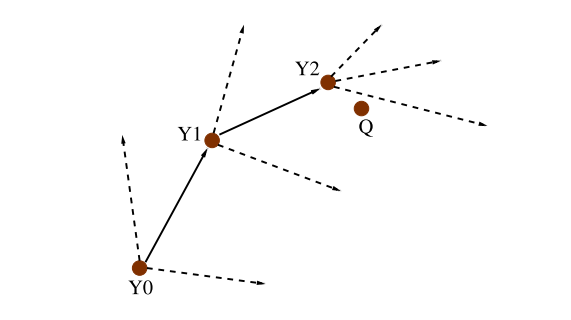

# GNNS

```
@inproceedings{DBLP:conf/ijcai/HajebiASZ11,
  author    = {Kiana Hajebi and
               Yasin Abbasi{-}Yadkori and
               Hossein Shahbazi and
               Hong Zhang},
  editor    = {Toby Walsh},
  title     = {Fast Approximate Nearest-Neighbor Search with k-Nearest Neighbor Graph},
  booktitle = {{IJCAI} 2011, Proceedings of the 22nd International Joint Conference
               on Artificial Intelligence, Barcelona, Catalonia, Spain, July 16-22,
               2011},
  pages     = {1312--1317},
  publisher = {{IJCAI/AAAI}},
  year      = {2011},
  url       = {https://doi.org/10.5591/978-1-57735-516-8/IJCAI11-222},
  doi       = {10.5591/978-1-57735-516-8/IJCAI11-222},
  timestamp = {Tue, 20 Aug 2019 16:16:04 +0200},
  biburl    = {https://dblp.org/rec/conf/ijcai/HajebiASZ11.bib},
  bibsource = {dblp computer science bibliography, https://dblp.org}
}
```

### Introduction

首次使用  k-NN  图和 hill-climbing 算法相结合的方法用于最近邻查询

<div align="center">  </div><br>

### Algorithm

>Input: a k-NN graph G = (D, E), a query point Q, the number of required nearest neighbors K, the number of random restarts R, the number of greedy steps T, and the number of expansions E. ρ is a distance function. N(Y, E, G) returns the first E neighbors of node Y in G. 
>
>S = {}. 
>
>U = {}. 
>
>Z = X1.
>
>for r = 1, . . . , R do  // 进行 R 次随机查找
>
>​	Y_0: a point drawn randomly from a uniform distribution over D.   // 随机抽取的 Y0 作为起始点
>
>​	for t = 1, . . . , T do 	// 进行 T 次迭代
>
>​		Y_t = $argmin_{Y∈N(Yt−1,E,G)} ρ(Y, Q)$. 	// 根据前一次迭代的结果，从中选取一个最接近查询点的点作为下一个提供候选点的点
>
>​		S = S U N(Yt−1, E, G).  // 将每次迭代的 Y 的 E 个最优候选点加入 S
>
>​		U = U U {ρ(Y, Q) : Y ∈ N(Yt−1, E, G)}. 	// 将这次迭代的 E 个最优候选点距离查询点的距离加入 U
>
>​	end for
>end for 
>
>Sort U, pick the first K elements, and return the corre- sponding elements in S.  // 根据 U 中的距离排序，选取最优的 K 个点作为 k 近邻

### Theorem


### Conclusions

* 优点：首次将 k-NN 和 hill-climbing 两种方法相结合，用以解决近邻搜索的问题
* 缺点：
  * 在离线构建索引过程中，近邻个数 k 选取过小，将导致图过于稀疏或不连通，搜索结果局部最优，召回率不理想；k 过大需要占用更大的内存且降低构建效率
* Future work：
  * 高维数据通常具有较低的 LID ， KD-tree 在低维情况下有较好的表现，GNNS 可能存在同样的结论
* 反思

  * ANNS 的整体思路
    * 构建 kNN 图，相当于构建离线索引，但此时仍不能完成查询的任务
    * 通过 NN - expansion 进行查询，具体方法为
      * 选取随机 R 个入口点
      * 对每个入口点进行 T 次 NN-expansion, 并记录候选点信息
      * 从候选点钟筛选出 k 近邻


*参考：*

[GNNS](https://github.com/SamuelGong/GNNS)


*TODO*：

* Theorem