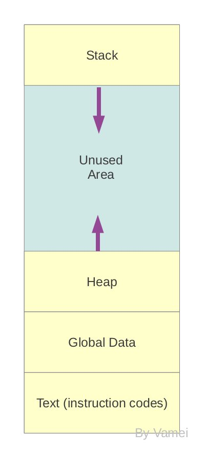
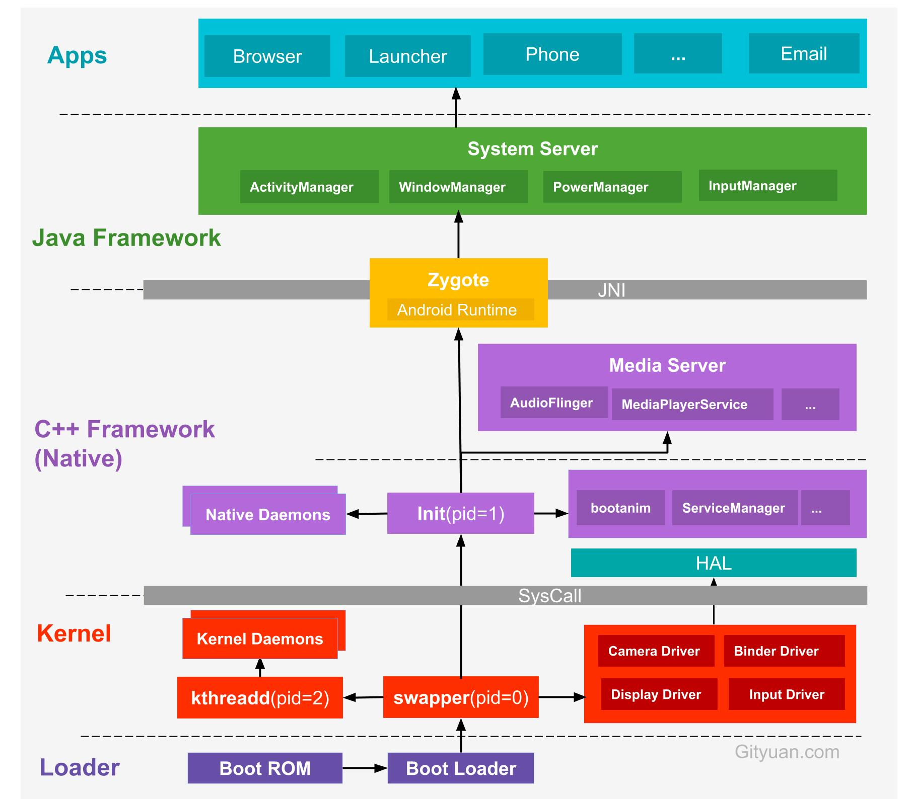
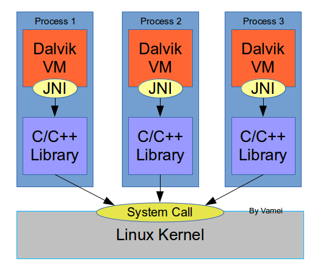
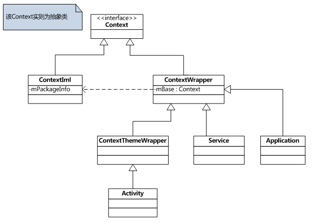
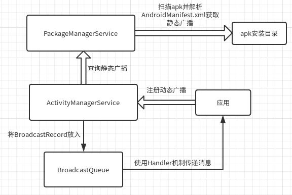

# Android 架构

## 引言

Android 整体架构设计清晰，从下至上分别为：Linux 内核、HAL、系统 Native 库、Android 运行时环境、Java 框架层 和 应用层五层。

  
 

## Linux 架构

Linux 利用内核实现软硬件沟通。系统调用是操作系统中最小的功能单位，Linux 通过系统调用将内核与应用层分离。库函数将系统调用组合成常用功能。

  
 

## 进程

进程拥有独立的空间，包含程序与数据。进程间通过 IPC 通信。

  
 

## Android 架构

  
 

### Loader

* Boot ROM: 当手机处于关机状态时，长按Power键开机，引导芯片开始从固化在ROM里的预设代码开始执行，然后加载引导程序到RAM
* Boot Loader：这是启动Android系统之前的引导程序，主要是检查RAM，初始化硬件参数等功能

### Linux Kernel

Android平台的基础是Linux内核，比如ART虚拟机最终调用底层Linux内核来执行功能。Linux内核的安全机制为Android提供相应的保障，也允许设备制造商为内核开发硬件驱动程序。

### HAL

不同于 Linux 驱动位于内核中，Android 在内核外增加了硬件抽象层 HAL(Hardware Abstraction Layer)，用于保护硬件驱动源代码。

### Android Runtime & 系统库

每个应用都在其自己的进程中运行，都有自己的虚拟机实例。ART通过执行DEX文件可在设备运行多个虚拟机，DEX文件是一种专为Android设计的字节码格式文件，经过优化，使用内存很少。ART主要功能包括：预先(AOT)和即时(JIT)编译，优化的垃圾回收(GC)，以及调试相关的支持。

这里的Native系统库主要包括init孵化来的用户空间的守护进程、HAL层以及开机动画等。启动init进程(pid=1),是Linux系统的用户进程，init进程是所有用户进程的鼻祖。

#### ~~Dalvik 虚拟机~~

Dalvik 虚拟机为 HAL 与 应用层 衔接的一层。当一个应用运行时，进程空间中将包含 Dalvik 虚拟机，Java 应用程序编译成的字节码文件，运行于此虚拟机中。
Dalvik 通过 JNI 调用底层 C/C++ 功能。

  
 

Dalvik 虚拟机内是一个虚拟进程空间，有自己的栈和堆。

### Framework

* Zygote进程，是由init进程通过解析init.rc文件后fork生成的，Zygote进程主要包含：
  * 加载ZygoteInit类，注册Zygote Socket服务端套接字
  * 加载虚拟机
  * 提前加载类preloadClasses
  * 提前加载资源preloadResouces

* System Server进程，是由Zygote进程fork而来，System Server是Zygote孵化的第一个进程，System Server负责启动和管理整个Java framework，包含ActivityManager，WindowManager，PackageManager，PowerManager等服务。

* Media Server进程，是由init进程fork而来，负责启动和管理整个C++ framework，包含AudioFlinger，Camera Service等服务。

### Application

* Zygote进程孵化出的第一个App进程是Launcher，这是用户看到的桌面App
* 所有的App进程都是由Zygote进程fork生成的
* 所有的App进程都是由Zygote进程fork生成

### Syscall && JNI

* Native与Kernel之间有一层系统调用(SysCall)层
* Java层与Native(C/C++)层之间的纽带JNI

# Context

Context 提供应用环境全局信息接口，允许我们获取以应用为特征的资源和特征，同时启动应用级的操作，如启动 Activity, Broadcasting，接收 Intent 等。

  
 

# Android 四大组件

Activity、Service、ContentProvider、BroadCaseReciver

## Activity

Activity 是与用户交互的第一接口，Android 系统通过 栈 管理 Activity。

## Broadcast Receiver

Broadcast Receiver 于 AMS(ActivityManagerService) 或 PMS 进行注册。发送广播时通过 Handler 机制遍历 BroadcastQueue 中的 BrodcastRecord，一一发送给 Broadcast Receiver。

整个流程使用了观察者模式。

  
 

## Content Provider

提供程序间数据共享功能，降低了隐私泄露的风险。

## Service

Service 是 Android 中实现后台运行的，无需交互且长时间运行的任务方案。服务运行于原进程空间中。

# Android 持久化技术

Android 共有三种常用 **应用内** 持久化方式：文件、SharedPreferences 和 数据库SQLite。

SharedPreferences 以键值对的方式存储数据。

Android 程序间数据共享主要通过 Content Provider。

