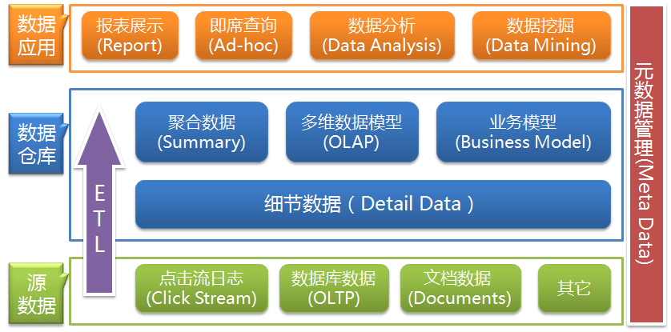

# 数据仓库和 OLAP 技术

## WHAT

数据仓库的目的是构建 **面向分析** 的集成化数据环境，为企业提供决策支持（Decision Support）。

**其实数据仓库本身并不“生产”任何数据，同时自身也不需要“消费”任何的数据**

数据仓库功能为 ETL(Extra、Transfer、Load)

## 数据仓库特征

### 面向主题

* 围绕一些主题，如顾客、供应商、产品等
* 关注决策者的数据建模与分析，而不是集中于组织机构的日常操作和事务处理
* 排除对于决策无用的数据，提供特定主题的简明视图

### 数据集成

* 一个数据仓库是通过集成多个异构数据源来构造的。
* 使用数据清理和数据集成技术。
  * 确保命名约定、编码结构、属性度量等的一致性
  * 当数据被移到数据仓库时，它们要经过转化

### 随时间变化

* 数据仓库是从历史的角度提供信息
    * 数据仓库的时间范围比操作数据库系统要长的多（操作数据库系统: 主要保存当前数据）
    * 数据仓库中的每一个关键结构都隐式或显式地包含时间元素，而操作数据库中的关键结构可能就不包括时间元素

### 数据不易丢失

* 尽管数据仓库中的数据来自于操作数据库，但他们却是在物理上分离保存的。
  * 操作数据库的更新操作不会出现在数据仓库环境下。
    不需要事务处理，恢复，和并发控制等机制
    只需要两种数据访问: 
    数据的初始转载和数据访问（读操作）

## 数据仓库与数据库系统

* 操作数据库系统的主要任务是联机事务处理OLTP
* 数据仓库的主要任务是联机分析处理OLAP

### OLAP VS. OLTP

* 用户和系统的面向性（顾客事务/市场分析）
* 数据内容（当前/历史)
* 数据库设计（ER/星型、雪花型和面向主题）
* 访问模式 事务操作 VS. 只读查询（但很多是复杂的查询）
* 数据库规模
* 度量 事务吞吐量 VS. 查询吞吐量、响应时间

## 数据仓库的概念模型

* 星型模式（Star schema）: **事实表** 在中心，周围围绕地连接着 **维表**（每维一个），事实表含有大量数据，没有冗余。
* 雪花模式（Snowflake schema）:  是星型模式的变种，其中某些维表是规范化的，因而把数据进一步分解到附加表中。结果，模式图形成类似于雪花的形状。
* 事实星座（Fact constellations）: 多个事实表共享维表, 这种模式可以看作星型模式集，因此称为星系模式（galaxy schema），或者事实星座（fact constellation） 

## 多维数据模型上的OLAP操作

上卷(roll-up):汇总数据
通过一个维的概念分层向上攀升或者通过维规约
当用维归约进行上卷时，一个或多个维由给定的数据立方体删除

下钻(drill-down)：上卷的逆操作
由不太详细的数据到更详细的数据，可以通过沿维的概念分层向下或引入新的维来实现 (为给定数据添加更多细节)

切片和切块(slice and dice)
切片操作在给定的数据立方体的一个维上进行选择，导致一个子方
切块操作通过对两个或多个维进行选择，定义子方

转轴(pivot)
立方体的重定位，可视化，或将一个3维立方体转化为一个2维平面序列
转轴是一种可视化操作，通过转动当前数据的视图来提供一个数据的替代表示

钻过(drill_across)：执行涉及多个事实表的查询

钻透(drill_through)：使用关系SQL机制，钻到数据立方体的底层，到后端关系表
其他OLAP操作可能包括列出表中最高或最低的N项，以及计算移动平均值、增长率、利润、统计函数等等

