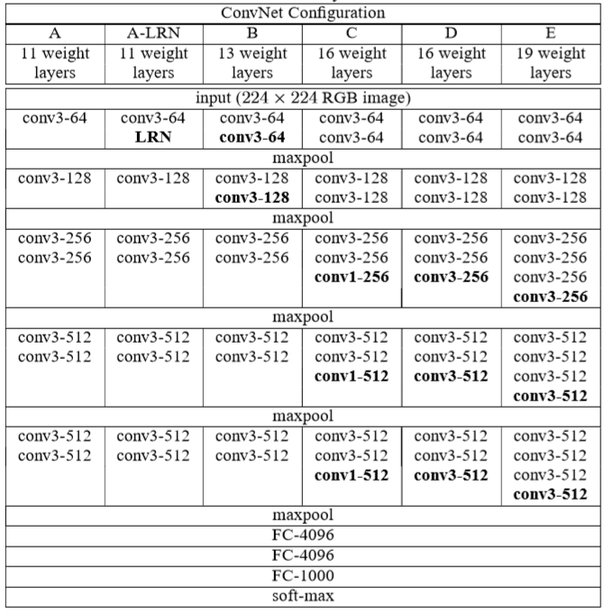
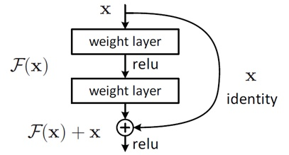

# 模型进化

* 更深更宽——AlexNet -> VGGNet
* 不同模型结构 - VGG -> InceptionNet / ResNet
* 优势组合 —— Inception + Res = InceptionResNet
* 自我学习 —— NASNet
* 实用 - MoblieNet

# AlexNet(2012)

使用两个CPU 使得神经网络更大，更快

输入：224*224，3通道
第一层卷积：11*11卷积核，96个，stride=4 输出 = （输入-卷积核+padding)/stride + 1 = 55
参数数目：3*11*11*96=35k

第二层卷积：5*5 256个
第二层max_pooling 2*2

第一层全连接：4096
第二层全连接：4096

softmax:1000 概率值

* 首次使用 ReLU -> 训练速度快
* 2-GPU并行结构
* 1,2,5 卷积后跟随max-pooling 层
* 两个全连接中dropout
    * 全连接层参数占全部参数数目的大部分，容易过拟合
    * 最后的结果相当于很多子网络组合，【组合会提升效果】
    * 消除了神经单元之间的依赖，增强泛化能力
    * dropout 后的结果，总能找到一个样本与其对应，相当于数据增强
* 数据增强，图片随机采样 [256, 256] 采样 [224, 224]
* Dropout = 0.5
* Batch size = 128
* SGD = 0.9
* Learning rate = 0.01，过一定次数降低为 1/10
* 7 个 CNN

* 总共8 层

# VGG(2014)

* 更深
* 多使用 3*3 卷积核
    * 2 个 3*3 卷积层可以看做一层5*5
    * 3 个 3*3 卷积层可以看做一层7*7
    * 2 层比 1 层更多一次非线性变换
    * 参数数目降低 28% (2*3*3 = 5*5 少7个参数)
* 1*1 卷积层可以看做是非线性变换，不同卷积是对每个通道进行卷积，1*1是对通道进行降维
* 每经过一个pooling层，通道数目翻倍

* 训练技巧

    * 先训练浅层网络，再训练深层网络
    * 多层次输入

* 加深层次的问题

    * 深度达到某个程度继续加深会导致准确率下降

# ResNet

深层网络更难优化而非学不到东西

FX+X  FX是残差学习

残差结构使得网络需要学习的知识变少，容易学习
残差结构使得每一层数据分布接近，容易学习

* resnet 每经过一次降采样过程，输入通道数翻倍，避免降采样信息损失

残差结构必须有两层，否则加了和没加一样
、

实线与虚线的区别 虚线：

# InceptionNet

问题：
* 更深的网络容易过拟合
* 更深的网络有更大计算量
  * 稀疏网络减少了参数但没有减少计算量

分组卷积

优势：
* 一层上同时使用多种卷积核，看到各种层级feature
* 不同组之间 feature 不交叉计算，减少计算量

V1结构——卷积计算量

(（Kw*Kh)*Ci)*((Ow*Oh)*Co)

* Inception 与普通 3*3 卷积相比

    * 假设输入通道 3， 输出通道 400
    * 普通 3*3 ： 3*3*3*400 = 10.8k
    * Inception: 3*1*1*100 + 3*3*3*100 + 3*5*5*100 = 10.5k

V2结构——引入3*3视野域同等卷积替换

V3结构

3*3 = 1*3 和 3*1
参数降低 33%

V4结构

引入 skip connection (ResNet)

# MobileNet

引入深度可分离卷积

    * 回顾 Inception
    * 分到极致 每个卷积只读一个通道
      * 普通卷积计算量 Kw*Kh*Ci*Co*Ow*Oh
      * 深度可分离
        * 深度可分离 Kw*Kh*Co*Ow*Oh
        * 1*1卷积   Ci*Co*Ow*Oh

* 模型对比与选择

3*3conv -> BN -> ReLU

3*3 Depthwise Conv -> BN -> ReLU -> 1*1 Conv -> BN -> ReLU