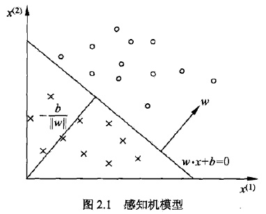
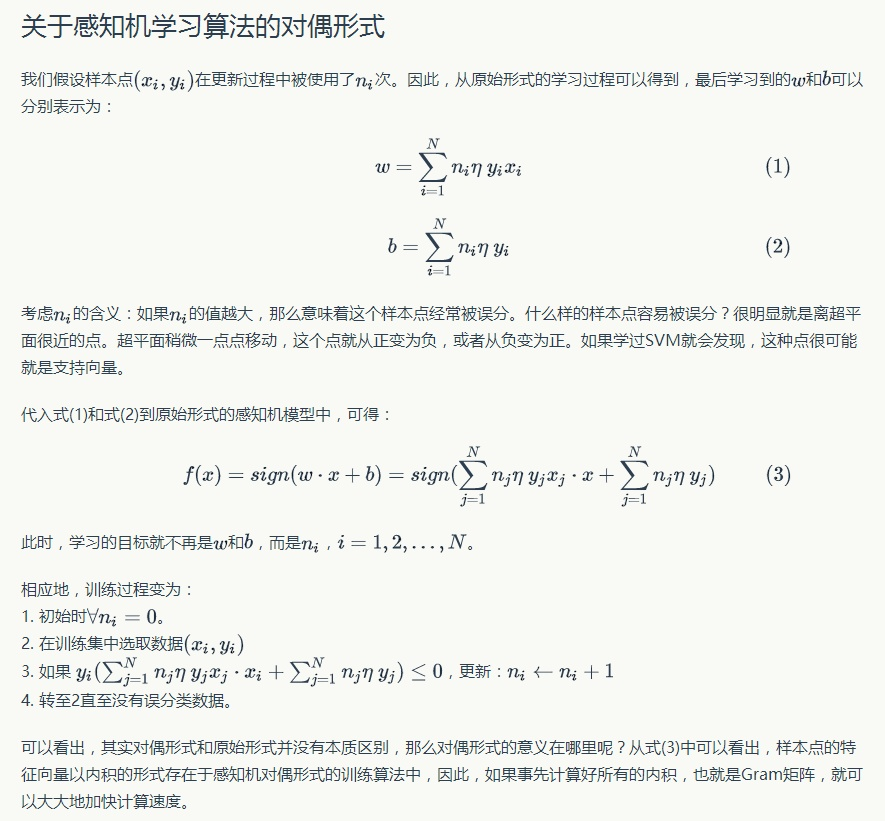

# 感知机

感知机(perception)是二分类的线性分类模型

## 模型

输入空间：$\mathcal X\sube \bf R^n$

输出空间：$\mathcal Y={+1,-1}$

决策函数：$f(x)=sign (w\cdot x+b)$

  
 

*w 为超平面法向量，b 为超平面截距。( Ax + By + Cz + D = 0, (A, B, C) 为法向量 )*

## 策略

确定学习策略就是定义 **经验** 损失函数并将损失函数最小化。

注意这里提到了 **经验**，所以学习是在**训练数据集**上的操作

#### 损失函数选择

> 损失函数的一个自然选择是误分类点的总数，但是，这样的损失函数**不是参数$w,b$的连续可导函数，不易优化**
>
> 损失函数的另一个选择是误分类点到超平面$S$的总距离，这是感知机所采用的

* 任意一点到超平面的距离（点到面的距离）：

$$\frac{1}{||w||}|w*x_0+b|$$

* 对于误分类的数据：

$$-y_i(w*x_i+b)>0$$

感知机学习的经验风险函数(损失函数)
$$
L(w,b)=-\sum_{x_i\in M}y_i(w\cdot x_i+b)
$$
其中$M$是误分类点的集合

给定训练数据集$T$，损失函数$L(w,b)$是$w$和$b$的连续可导函数

## 算法

#### 原始形式

感知机学习算法是对以下问题的最优化问题：

输入：

$$T=\{(x_1,y_1),(x_2,y_2),\dots,(x_N,y_N)\}\\ x_i\in \mathcal X=\bf R^n \\ ,y_i\in \mathcal Y\it =\{-1,+1\}$$

输出：$w,b;f(x)=sign(w\cdot x+b)$

步骤：
1. 选取初值$w_0,b_0$

1. 训练集中选取数据$(x_i,y_i)$

1. 如果$y_i(w\cdot x_i+b)\leqslant 0$
    $$
    w\leftarrow w+\eta y_ix_i \\
    b\leftarrow b+\eta y_i
    $$
4. 转至 2，直至训练集中没有误分类点

注意这个原始形式中的迭代公式，可以对$x​$补1，将$w​$和$b​$合并在一起，合在一起的这个叫做扩充权重向量。

#### 对偶形式

对偶形式的基本思想是将$w$和$b$表示为实例$x_i$和标记$y_i$的线性组合的形式，通过求解其系数而求得$w$和$b$。

输入：

$$T=\{(x_1,y_1),(x_2,y_2),\dots,(x_N,y_N)\}\\ x_i\in \mathcal{X}=\bf{R}^n , y_i\in \mathcal{Y} =\{-1,+1\}, i=1,2,\dots, N; 0< \eta \leqslant 1$$

输出：
 $$
 \alpha ,b; f(x)=sign\left(\sum_{j=1}^N\alpha_jy_jx_j\cdot x+b\right)\\
 \alpha=(\alpha_1,\alpha_2,\cdots,\alpha_N)^T
 $$

**推导**：

其中 

$$\alpha_i = \eta n_i$$

则

$$
n_i \leftarrow n_i + 1 \\

\alpha_i \leftarrow \alpha + \eta 
$$

1. $\alpha \leftarrow 0,b\leftarrow 0​$

2. 训练集中选取数据$(x_i,y_i)$

3. 如果$y_i\left(\sum_{j=1}^N\alpha_jy_jx_j\cdot x_i+b\right) \leqslant 0​$
 $$
 \alpha_i\leftarrow \alpha_i+\eta\\
 b\leftarrow b+\eta y_i
 $$

4. 转至(2)，直至训练集中没有误分类点

**Gram matrix**

对偶形式中，训练实例仅以内积的形式出现。

为了方便可预先将训练集中的实例间的内积计算出来并以矩阵的形式存储，这个矩阵就是所谓的Gram矩阵
$$
G=[x_i\cdot x_j]_{N\times N} 
$$

*参考*：

[感知机](https://www.hankcs.com/ml/the-perceptron.html)

[感知机—2.3.3 对偶形式](https://www.bilibili.com/video/BV1m4411d7Er?from=search&seid=6197431762999819062)