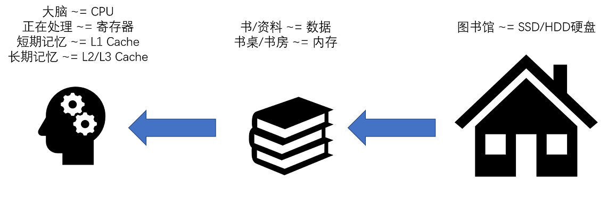
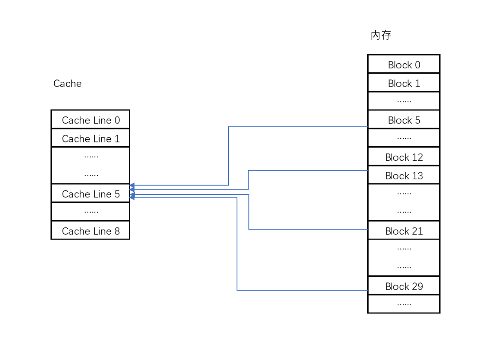

<!-- GFM-TOC -->
* [多级存储系统](#多级存储系统)
* [Cache](#Cache) 
  * [Cache映射](#Cache映射)
* [计算机性能指标](#计算机性能指标)
    * [性能优化](#性能优化) 
<!-- GFM-TOC -->

# 多级存储系统

* CPU
* Register
* Cache：由 SRAM 组成，CPU 中 通常有 L1, L2, L3 三层缓存

<div align="center">  </div><br>

* 内存：内存由 DRAM 组成
* 外存：SSD固态硬盘、HDD机械硬盘

<div align="center">  </div><br>

计算机存储系统主要存在 **容量、速度、成本** 3 个相互制约的矛盾。同时计算机存在 **空间局部性和时间局部性**。因此采用 三级结构 解决这一矛盾。


<div align="center">  </div><br>


# Cache

```java
int[] arr = new int[64 * 1024 * 1024];

// 循环1
long start = System.currentTimeMillis();
for (int i = 0; i < arr.length; i++) arr[i] *= 3;
long end = System.currentTimeMillis();
System.out.println((end - start) + "ms");

// 循环2
start = System.currentTimeMillis();
for (int i = 0; i < arr.length; i += 16) arr[i] *= 3;
end = System.currentTimeMillis();
System.out.println((end - start) + "ms");
```

> 54ms
>
> 39ms


*Cache line 大小通常为 64 B，循环1和循环2 访问相同数量的Cache Line，因此时间差别不大*

## Cache 映射

### 直接映射

直接映射通过 mod 运算实现

<div align="center">  </div><br>

实际计算中，有一个小小的技巧，通常我们会把缓存块的数量设置成 2 的 N 次方。这样在计算取模的时候，可以直接取地址的低 N 位，也就是二进制里面的后几位。比如这里的 8 个缓存块，就是 2 的 3 次方。那么，在对 21 取模的时候，可以对 21 的 2 进制表示 10101 取地址的低三位，也就是 101，对应的 5，就是对应的缓存块地址。

为了区别映射的不同内存块，会使用 **组标记** 进行区分。即内存地址的剩余位。

一个内存的访问地址，最终包括高位代表的组标记、低位代表的索引，以及在对应的 Data Block 中定位对应字的位置偏移量。

<div align="center">  </div><br>

而内存地址对应到 Cache 里的数据结构，则多了一个有效位和对应的数据，由“索引 + 有效位 + 组标记 + 数据”组成。

如果内存中的数据已经在 CPU Cache 里了，那一个内存地址的访问，就会经历这样 4 个步骤：

* 根据内存地址的低位，计算在 Cache 中的索引；
* 判断有效位，确认 Cache 中的数据是有效的；
* 对比内存访问地址的高位，和 Cache 中的组标记，确认 Cache 中的数据就是我们要访问的内存数据，从 Cache Line 中读取到对应的数据块（Data Block）；
* 根据内存地址的 Offset 位，从 Data Block 中，读取希望读取到的字。


## Cache更新

```java

public class VolatileTest {
    private static volatile int COUNTER = 0;

    public static void main(String[] args) {
        new ChangeListener().start();
        new ChangeMaker().start();
    }

    static class ChangeListener extends Thread {
        @Override
        public void run() {
            int threadValue = COUNTER;
            while ( threadValue < 5){
                if( threadValue!= COUNTER){
                    System.out.println("Got Change for COUNTER : " + COUNTER + "");
                    threadValue= COUNTER;
                }
            }
        }
    }

    static class ChangeMaker extends Thread{
        @Override
        public void run() {
            int threadValue = COUNTER;
            while (COUNTER <5){
                System.out.println("Incrementing COUNTER to : " + (threadValue+1) + "");
                COUNTER = ++threadValue;
                try {
                    Thread.sleep(500);
                } catch (InterruptedException e) { e.printStackTrace(); }
            }
        }
    }
}
```

>Incrementing COUNTER to : 1
>
>Got Change for COUNTER : 1
>
>Incrementing COUNTER to : 2
>
>Got Change for COUNTER : 2
>
>Incrementing COUNTER to : 3
>
>Got Change for COUNTER : 3
>
>Incrementing COUNTER to : 4
>
>Got Change for COUNTER : 4
>
>Incrementing COUNTER to : 5
>
>Got Change for COUNTER : 5


```java
private static int COUNTER = 0;   // 去掉 volatile
```

>Incrementing COUNTER to : 1
>
>Got Change for COUNTER : 1
>
>Incrementing COUNTER to : 2
>
>Incrementing COUNTER to : 3
>
>Incrementing COUNTER to : 4
>
>Incrementing COUNTER to : 5


volatile 确保对于此变量的读取和写入，一定会同步到主内存，而不是从 Cache 中读取。

第二段代码中，ChangeListener 又是一个忙等待的循环，它尝试不停地获取 COUNTER 的值，这样就会从当前线程的“Cache”里面获取。于是，这个线程就没有时间从主内存里面同步更新后的 COUNTER 值。这样，它就一直卡死在 COUNTER=0 的死循环上了。

### Cache 与 主存 数据更新

* 写直达：每次都要写入到主内存中，速度慢
* 写回：若数据在 Cache 中，只更新 Cache, 并更新为脏数据

### 多 CPU 缓存一致性

MESI


# 虚拟内存

把虚拟内存映射到物理内存，最直观的方法就是构建映射表，即页表。内存地址分为页号和偏移量，内存地址转换分为三步：

* 把虚拟内存地址，切分成页号和偏移量的组合；
* 从页表里面，查询出虚拟页号，对应的物理页号；
* 直接拿物理页号，加上前面的偏移量，就得到了物理内存地址。

<div align="center">  </div><br>

## 多级映射

单纯映射表占用空间太大，因此使用多级页表。

实际程序进程中，占用的地址空间通常为连续空间，而不是随机内存空间，因此页表树，适合这样的内存分布。

# 内存保护

## 性能问题

页表缓存——TLB

## 内存安全问题

* 可执行空间保护

* 地址空间布局随机化


