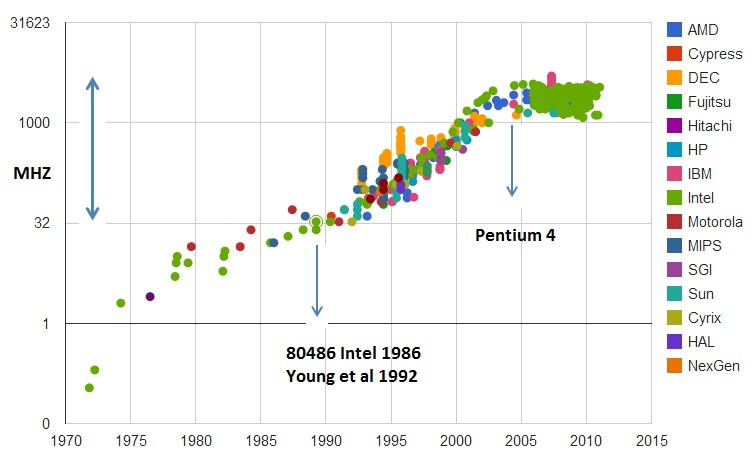

<!-- GFM-TOC -->
* [计算机系统层次结构](#计算机系统层次结构)
    * [冯诺依曼计算机](#冯诺依曼计算机) 
* [计算机性能指标](#计算机性能指标)
    * [性能优化](#性能优化) 
<!-- GFM-TOC -->

# 计算机系统层次结构

## 冯·诺依曼结构（普林斯顿体系结构、存储程序结构）

  
 

* 五大部件：运算器、控制器、存储器、输入设备、输出设备

* 指令和数据以二进制形式存放在存储器中

* 指令在存储器内按顺序存放

* 指令由操作码、地址码

* 以运算器为中心

# 计算机性能指标

* 吞吐量

* 时钟周期：计算机的计时单位

* 主频

* CPI：执行一条指令所需时钟周期数

## 性能优化

**程序的 CPU 执行时间 = CPU 时钟周期数 × 时钟周期 = 指令数 × CPI × 时钟周期**

* 时钟周期：等效于计算机主频，取决于计算机硬件

  
 

* CPI：现代 CPU 通过流水线技术，让一条指令所需 CPU Cycle 尽可能少

* 指令数：代表执行程序需要多少指令、哪些指令，取决于编译器