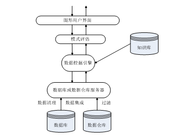

# 数据挖掘概述

## WHAT

从大量的数据中挖掘令人感兴趣的、有用的、隐含的的模式或知识。

**interesting、useful、hidden、massive**

## HOW

* 数据清理：消除噪音或不一致数据

* 数据集成：多种数据源可以组合在一起

* 数据变换：数据变换或统一成适合挖掘的形式

* 数据挖掘：基本步骤，使用智能方法提取数据模式

* 模式评估：根据某种兴趣度度量，识别提供知识的真正有趣的模式

* 知识表示：使用可视化和知识表示技术，向用户提供挖掘的知识

## 数据挖掘功能

数据挖掘任务可以分两类 ：描述和预测

* 概念描述：特征和区分

* 关联分析

* 分类和预测

* 聚类分析

* 孤立点分析

* 演变分析

## 小结

由于数据爆炸性增长，导致数据分析的需求增长，数据挖掘应运而生。

数据挖掘即在大量(massive)数据中挖掘 interesting、hidden、useful 的模式。过程包括数据清洗、数据集成、数据变换、数据挖掘、模式评估和数据表示。
