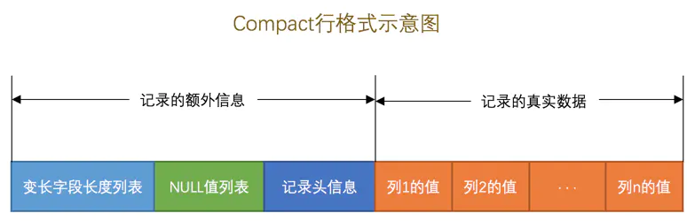
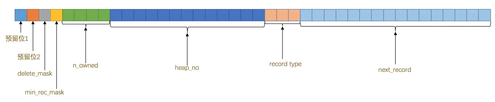
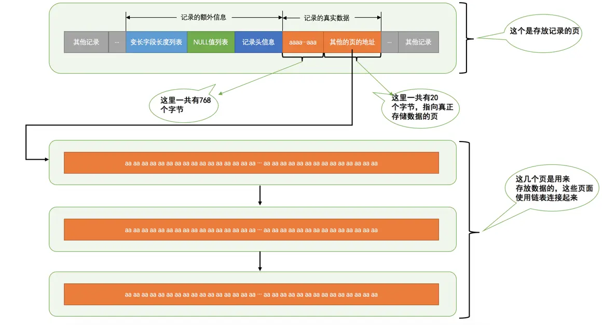
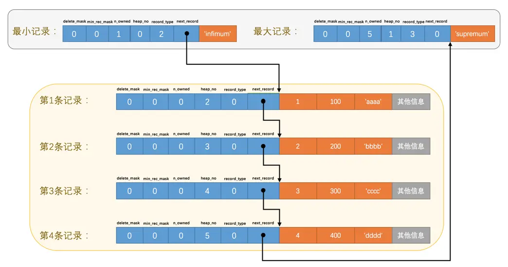
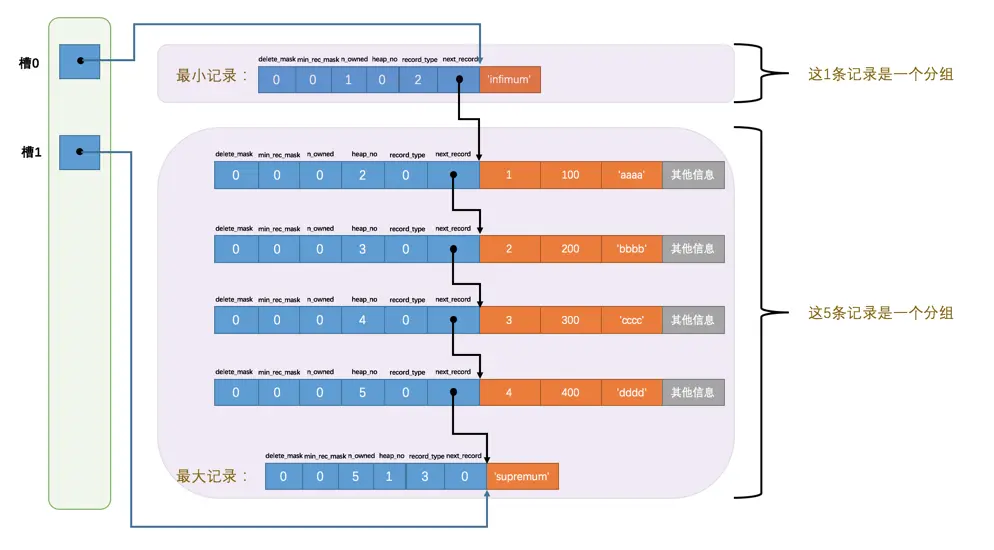

<!-- GFM-TOC -->
* [InnoDB行](#InnoDB行)
  * [Compact行格式](#Compact行格式) 
  * [Redunant行格式](#Redunant行格式)
  * [Dynamic和Compressed行格式](#Dynamic和Compressed行格式)
* [InnoDB页](#InnoDB页)
  * [记录头信息](#记录头信息) 
  * [Page Directory 页目录](#Page Directory 页目录)
  * [Page Header页面头部](#Page Header页面头部)
  * [File Header文件头部](#File Header文件头部)
* [小结](#小结)
<!-- GFM-TOC -->

# InnoDB行

我们平时是以记录为单位来向表中插入数据的，这些记录在磁盘上的存放方式也被称为行格式或者记录格式。目前共有 4 中不同类型的行格式：Compact、Redundant、Dynamic、Compressed。可以通过如下语法在创建或修改表语句中指定行格式：

```sql
CREATE TABLE 表名 (
    列的信息
) ROW_FORMAT=行格式名称

ALTER TABLE 表名 ROW_FORMAT=行格式名称
```

## Compact行格式

<div align="center">  </div><br>

一条完整的记录其实可以被分为记录的额外信息和记录的真实数据两大部分，下边我们详细看一下这几部分的组成。

### 变长字段长度列表

MySQL支持一些变长的数据类型，比如 VARCHAR(M)、VARBINARY(M)、各种 TEXT 类型，各种 BLOB 类型，我们也可以把拥有这些数据类型的列称为变长字段，变长字段中存储多少字节的数据是不固定的，所以我们在存储真实数据的时候需要顺便把这些数据占用的字节数也存起来，这样才不至于把 MySQL 服务器搞懵，所以这些变长字段占用的存储空间分为两部分：

* 真正数据内容

* 占用字节数

在 Compact 行格式中，把所有变长字段的真实数据占用的字节长度都存放在记录的开头部位，从而形成一个变长字段长度列表，各变长字段数据占用的字节数按照列的顺序 **逆序** 存放。

### NULL值列表

表中的某些列可能存储 NULL 值，Compact 行格式把这些值为 NULL 的列统一管理起来，存储到 NULL 值列表中，它的处理过程是这样的：

* 统计表中允许存储NULL的列：主键列、被 NOT NULL 修饰的列不可以存储 NULL。如果表中没有允许存储 NULL 的列，则 NULL值列表 也不存在。

* 二进制位存储列：将每个允许存储 NULL 的列对应一个二进制位，二进制位按照列的顺序 **逆序** 排列，1 表示该列允许 NULL。NULL 值列表必须用整个字节的位表示，不满则高位补 0。

### 记录头信息

<div align="center">  </div><br>

| 名称      |大小(bit) |   描述   |
| :--------: | :--------:| :------: |
| 预留位1    |   1 |  没有使用  |
| 预留位2	| 1	| 没有使用|
|delete_mask|	1	|标记该记录是否被删除|
|min_rec_mask|	1	|B+树的每层非叶子节点中的最小记录都会添加该标记|
|n_owned|	4	|表示当前记录拥有的记录数|
|heap_no|	13	|表示当前记录在记录堆的位置信息|
|record_type	| 3	|表示当前记录的类型，0表示普通记录，1表示B+树非叶子节点记录，2表示最小记录，3表示最大记录|
|next_record	|16|	表示下一条记录的相对位置|

### 记录的真实数据

记录的真实数据除了自定义的列的数据外，也存在一些隐藏列：

| 列名      | 是否必须 |   大小   | 描述|
| :--------: | :--------:| :------: | :------: |
|row_id	    |否	|6字节|	行ID，唯一标识一条记录|
|transaction_id	|是	|6字节	|事务ID|
|roll_pointer	|是|	7字节	|回滚指针|

这里需要提一下InnoDB表对主键的生成策略：优先使用用户自定义主键作为主键，如果用户没有定义主键，则选取一个Unique键作为主键，如果表中连Unique键都没有定义的话，则InnoDB会为表默认添加一个名为row_id的隐藏列作为主键。所以我们从上表中可以看出：InnoDB存储引擎会为每条记录都添加 transaction_id 和 roll_pointer 这两个列，但是 row_id 是可选的（在没有自定义主键以及Unique键的情况下才会添加该列）。这些隐藏列的值不用我们操心，InnoDB存储引擎会自己帮我们生成的。

## Redunant行格式

Redundant 行格式是 MySQL 5.0 之前使用的行格式。

<div align="center">  </div><br>

Redundant 与 Compact 主要有两种区别：

* 字段长度编译列表

  * 没有了变长两个字，意味着 Redundant 行格式会把该条记录中所有列（包括隐藏列）的长度信息都按照逆序存储到字段长度偏移列表

  * 多了个偏移两个字，这意味着计算列值长度的方式不像 Compact 行格式那么直观，它是采用两个相邻数值的差值来计算各个列值的长度。

* 记录头信息不同

### 行溢出数据

在 Compact 和 Redundant 行格式中，对于占用存储空间非常大的列，在记录的真实数据处只会存储该列的一部分数据，把剩余的数据分散存储在几个其他的页中，然后记录的真实数据处用 20 个字节存储指向这些页的地址（当然这 20 个字节中还包括这些分散在其他页面中的数据的占用的字节数），从而可以找到剩余数据所在的页，如图所示：

<div align="center">  </div><br>

从图中可以看出来，对于 Compact 和 Redundant 行格式来说，如果某一列中的数据非常多的话，在本记录的真实数据处只会存储该列的前768个字节的数据和一个指向其他页的地址，然后把剩下的数据存放到其他页中，这个过程也叫做行溢出，存储超出768字节的那些页面也被称为溢出页。

## Dynamic和Compressed行格式

这两种行格式在在处理行溢出数据时与 Compact 和 Redundant 不同。另外，Compressed行格式会采用压缩算法对页面进行压缩。


# InnoDB页

InnoDB 是一个将表中的数据存储到磁盘上的存储引擎，而真正处理数据的过程是发生在内存中的，所以需要把磁盘中的数据加载到内存中。

InnoDB 将数据划分为若干个页，以页作为磁盘和内存之间交互的基本单位，InnoDB中页的大小一般为 16 KB。存放记录的页称为索引页。


<div align="center">  </div><br>

| 名称      |大小   | 描述|
| :--------: | :--------:| :------: |
|File Header|38字节	|页的一些通用信息|
|Page Header|56字节|数据页专有的一些信息|
|Infimum + Supremum	|26字节	|两个虚拟的行记录|
|User Records|不确定	|实际存储的行记录内容|
|Free Space	|不确定	|页中尚未使用的空间|
|Page Directory	|不确定	|页中的某些记录的相对位置|
|File Trailer|8字节	|校验页是否完整|


## 记录头信息

分析记录在 User Records 如何表示，需要 InnoDB 行中学过的记录头信息。

* delete_mask

标记当前记录是否删除，所有被删除掉的记录组成 **垃圾链表**


* min_res_mask

B+ 树的每层非叶子节点中的最小记录都会添加该标记。

* n_owned

* heap_no

表示当前记录在本页中的位置。heap_no 0 和 1 分别为 MySQL 自动添加的 **最小记录** 和 **最大记录**，用于比较主键的大小。

* record_type

表示当前记录类型，一共有4种类型的记录，0表示普通记录，1表示 B+ 树非叶节点记录，2表示最小记录，3表示最大记录

* next_record

next_record 表示从当前记录的真实数据到下一条记录的真实数据的地址偏移量。下一条记录指得并不是按照我们插入顺序的下一条记录，而是按照主键值由小到大的顺序的下一条记录。而且规定 Infimum记录（也就是最小记录） 的下一条记录就是本页中主键值最小的用户记录，而本页中主键值最大的用户记录的下一条记录就是 Supremum记录（也就是最大记录）。

<div align="center">  </div><br>

**不论我们怎么对页中的记录做增删改操作，InnoDB 始终会维护一条记录的单链表，链表中的各个节点是按照主键值由小到大的顺序连接起来的。**

## Page Directory 页目录

现在我们了解了记录在页中按照主键值由小到大顺序串联成一个单链表，那如果我们想根据主键值查找页中的某条记录该咋办呢？

* 将所有正常的记录（包括最大和最小记录，不包括标记为已删除的记录）划分为几个组

* 每个组的 **最后** 一条记录（也就是组内最大的那条记录）的头信息中的 n_owned属性表示该记录对应的组拥有多少条记录

* 将每个组的最后一条记录的地址偏移量单独提取出来按顺序存储到靠近页的尾部的地方，这个地方就是所谓的Page Directory，也就是页目录。页面目录中的这些地址偏移量被称为槽（英文名：Slot），所以这个页面目录就是由槽组成的。

<div align="center">  </div><br>

*对于最小记录所在的分组只能有 1 条记录，最大记录所在的分组拥有的记录条数只能在 1~8 条之间，剩下的分组中记录的条数范围只能在是 4~8 条之间*

<div align="center">  </div><br>

>因为各个槽代表的记录的主键值都是从小到大排序的，所以我们可以使用所谓的 **二分法** 来进行快速查找。
>
>5个槽的编号分别是：0、1、2、3、4，所以初始情况下最低的槽就是low=0，最高的槽就是high=4。比方说我们想找主键值为6的记录，过程是这样的：
>
>计算中间槽的位置：(0+4)/2=2，所以查看槽2对应记录的主键值为8，又因为8 > 6，所以设置high=2，low保持不变。
>
>重新计算中间槽的位置：(0+2)/2=1，所以查看槽1对应的主键值为4，又因为4 < 6，所以设置low=1，high保持不变。
>
>因为high - low的值为1，所以确定主键值为6的记录在槽2对应的组中。此刻我们需要找到槽2中主键值最小的那条记录，然后沿着单向链表遍历槽2中的记录。但是我们前边又说过，每个槽对应的记录都是该组中主键值最大的记录，这里槽2对应的记录是主键值为8的记录，怎么定位一个组中最小的记录呢？别忘了各个槽都是挨着的，我们可以很轻易的拿到槽1对应的记录（主键值为4），该条记录的下一条记录就是槽2中主键值最小的记录，该记录的主键值为5。所以我们可以从这条主键值为5的记录出发，遍历槽2中的各条记录，直到找到主键值为6的那条记录即可。由于一个组中包含的记录条数只能是1~8条，所以遍历一个组中的记录的代价是很小的。

所以在一个数据页中查找指定主键值的记录的过程分为两步：

* 通过二分法确定该记录所在的槽，并找到该槽所在分组中主键值最小的那条记录
* 通过记录的next_record属性遍历该槽所在的组中的各个记录


## Page Header页面头部

记录 **数据页** 中存储的记录的状态信息

|名称|	占用空间大小|	描述|
| :--------: | :--------:| :------: |
|PAGE_N_DIR_SLOTS	|2字节|	在页目录中的槽数量|
|PAGE_HEAP_TOP	|2字节|	还未使用的空间最小地址，也就是说从该地址之后就是Free Space|
|PAGE_N_HEAP	|2字节|	本页中的记录的数量（包括最小和最大记录以及标记为删除的记录）|
|PAGE_FREE	|2字节|	第一个已经标记为删除的记录地址（各个已删除的记录通过next_record也会组成一个单链表，这个单链表中的记录可以被重新利用）|
|PAGE_GARBAGE	|2字节|	已删除记录占用的字节数|
|PAGE_LAST_INSERT	|2字节|	最后插入记录的位置|
|PAGE_DIRECTION	|2字节|	记录插入的方向|
|PAGE_N_DIRECTION	|2字节|	一个方向连续插入的记录数量|
|PAGE_N_RECS	|2字节|	该页中记录的数量（不包括最小和最大记录以及被标记为删除的记录）|
|PAGE_MAX_TRX_ID	|8字节|	修改当前页的最大事务ID，该值仅在二级索引中定义|
|PAGE_LEVEL	|2字节|	当前页在B+树中所处的层级|
|PAGE_INDEX_ID	|8字节|	索引ID，表示当前页属于哪个索引|
|PAGE_BTR_SEG_LEAF	|10字节|	B+树叶子段的头部信息，仅在B+树的Root页定义|
|PAGE_BTR_SEG_TOP	|10字节|	B+树非叶子段的头部信息，仅在B+树的Root页定义|

## File Header文件头部

记录 **各种类型的页** 的状态信息

|名称|	占用空间大小	|描述|
| :--------: | :--------:| :------: |
|FIL_PAGE_SPACE_OR_CHKSUM|	4字节|	页的校验和（checksum值）|
|FIL_PAGE_OFFSET|	4字节|	页号|
|FIL_PAGE_PREV|	4字节|	上一个页的页号|
|FIL_PAGE_NEXT|	4字节|	下一个页的页号|
|FIL_PAGE_LSN|	8字节|	页面被最后修改时对应的日志序列位置（英文名是：Log Sequence Number）|
|FIL_PAGE_TYPE|	2字节	|该页的类型|
|FIL_PAGE_FILE_FLUSH_LSN|	8字节	|仅在系统表空间的一个页中定义，代表文件至少被刷新到了对应的LSN值|
|FIL_PAGE_ARCH_LOG_NO_OR_SPACE_ID|	4字节|	页属于哪个表空间|

* FIL_PAGE_PREV 和 FIL_PAGE_NEXT

FIL_PAGE_PREV和FIL_PAGE_NEXT就分别代表本页的上一个和下一个页的页号。这样通过建立一个双向链表把许许多多的页就都串联起来了，而无需这些页在物理上真正连着。需要注意的是，并不是所有类型的页都有上一个和下一个页的属性，不过我们本集中唠叨的数据页（也就是类型为FIL_PAGE_INDEX的页）是有这两个属性的，所以所有的数据页其实是一个双链表，就像这样：

<div align="center">  </div><br>

# 小结

* InnoDB 行总共有 4 中行格式 : Compact、Redundant、Dynamic 和 Compressed

* Compact 主要分为记录的额外信息（变长字段长度列表、NULL值列表、记录头信息）和真实数据

* 记录中数据太多超出页的大小，会将多余数据存储到其他页，称为行溢出

* InnoDB 页为 16kb，分为多种类型，存放记录的为数据页

* 数据页分为 7 个部分：
    * File Header : 存放页的通用信息
    * Page Header : 存放数据页专有信息
    * Infinum + supernum : 最小、最大记录
    * User Record : 插入的真实数据
    * Free Space : 页中未使用部分
    * Page Directory : 槽在页面中的地址偏移量
    * File Tailer : 校验部分

* 数据页组成双链表

* 记录间组成单链表，使用 Page Directory 进行查找
    * 二分法查找组
    * 顺序查找组内记录
