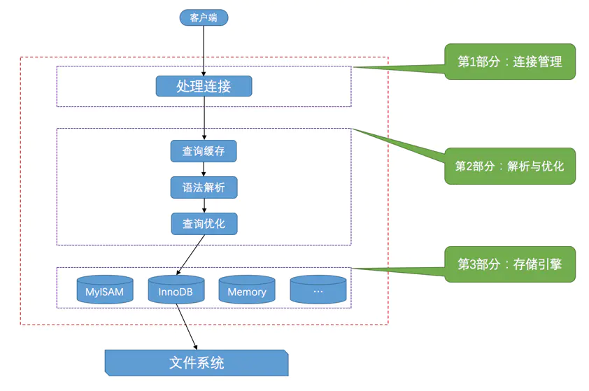

<!-- GFM-TOC -->
* [客户端连接服务器](#客户端连接服务器)
* [服务器处理客户端请求](#服务器处理客户端请求)
  * [连接管理](#连接管理) 
  * [解析优化](#解析优化)
  * [存储引擎](#存储引擎)
* [小结](#小结)
<!-- GFM-TOC -->

MySQL 使用 C/S 架构。MySQL 服务器进程默认名称为 **mysqld**，客户端进程默认名称为 **mysql**。

# 客户端连接服务器

客户端与服务端通信的过程本质上是一个进程间通信的过程。MySQL 支持一下三种通信方式：

* TCP/IP

* 命名管道和共享内存(Windows)

* Unix 域套接字文件(类 Unix)

假设启动 MySQL 服务器进程，客户端使用 TCP/IP 方式连接服务器语句为：

> mysql -h主机名 -u用户名 -p密码 -P服务器监听端口号


# 服务器处理客户端请求

在 Windows 中 mysqld 一般需要被注册为 Windows 服务，默认申请 **3306** 端口：

>"C:\Program Files\MySQL\MySQL Server 5.7\bin\mysqld" --install

mysqld 注册为 windows 服务后，可通过如下命令启动和关闭 MySQL 服务器程序：

> net start MySQL

> net stop MySQL

服务器处理客户端查询请求大致需要三个部分：连接管理、解析优化、存储引擎。

<div align="center">  </div><br>

## 连接管理

每当一个客户端进程连接到服务器进程，服务器进程都会创建一个线程专门处理与此客户端的交互。当客户端连接太多，即线程分配的数量太多时，将会严重影响系统性能。

客户端发起连接时，需要携带主机信息、用户名、密码，服务器端会对客户端程序提供的这些信息进行验证。此外客户端和服务器不运行在一台计算机上时，还可以采用 SSL 网络连接通信。

## 解析优化

MySQL 服务器获取到文本形式的请求，还需要经过 查询缓存、语法解析、查询优化等步骤。

### 查询缓存

MySQL 服务器程序会将刚刚处理过的查询请求和结果缓存，这个缓存可以在不同客户端间共享。

MySQL 缓存系统会监测涉及到的每张表，若表结构或数据被修改，则将相关高速缓存删除。

*尽管缓存有时能提升系统性能，但同时造成许多额外开销。从 MySQL 5.7.20 开始，不推荐使用查询缓存，并在 MySQL 8.0 中删除*

### 语法解析

对文本进行词法解析、语法分析、语义分析等处理

### 查询优化

MySQL 优化程序将会对我们的语句进行一些优化，如外连接转换为内连接、表达式简化、子查询转为连接。我们可以使用 EXPLAIN 查看语句执行计划。

## 存储引擎

MySQL 服务器把数据的存储和提取操作都封装到了一个叫存储引擎的模块里。我们知道表是由一行一行的记录组成的，但这只是一个逻辑上的概念，物理上如何表示记录，怎么从表中读取数据，怎么把数据写入具体的物理存储器上，这都是存储引擎负责的事情。为了实现不同的功能，MySQL提供了各式各样的存储引擎，不同存储引擎管理的表具体的存储结构可能不同，采用的存取算法也可能不同。

常用的引擎包括 InnoDB、MyISAM 和 Memory。其中 InnoDB 是 MySQL 默认存储引擎。

我们可以使用如下命令查询当前服务器支持的存储引擎：
```sql
SHOW ENGINES;
```

创建表时指定存储引擎：

```sql
CREATE TABLE 表名(
    建表语句
)ENGINE=存储引擎;
```

修改表的存储引擎：
```sql
ALTER TABLE 表名 ENGINE = 存储引擎名称;
```

# 小结

MySQL 架构为 C/S 架构。客户端连接服务器主要有 TCP/IP、共享内存和管道、套接字方式。服务器端处理客户端请求，主要分为 3 个步骤：

* 连接管理：为每个客户端连接专门分配一个线程负责通信，同时也容易导致线程过多的问题
* 解析优化：查询缓存、语法解析（编译原理相关）、查询优化
* 存储引擎：在物理上完成查询操作，MySQL 主要使用 InnoDB 引擎