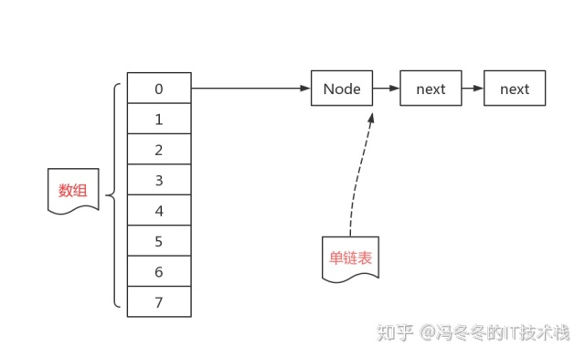
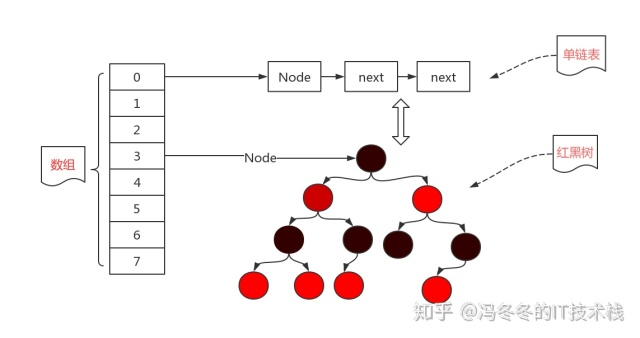
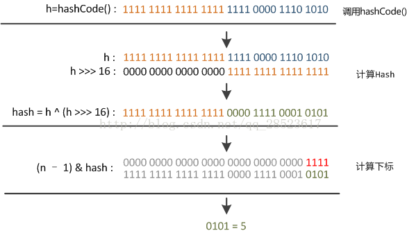
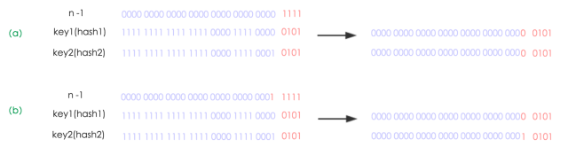
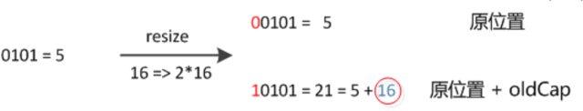
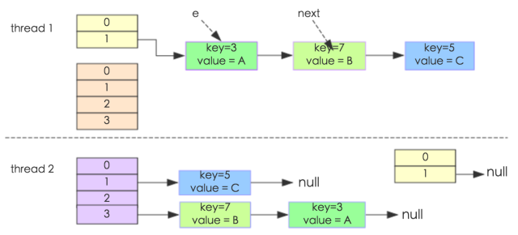
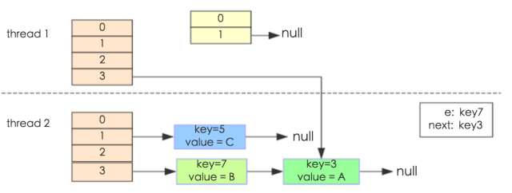
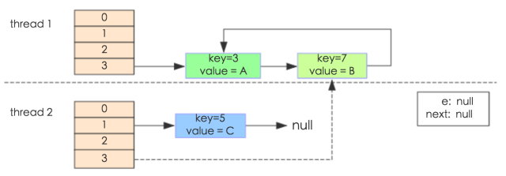

# HashMap

**本文章基于 JDK 1.8**

本文将从 HashMap 的底层数据结构、增删改查原理、扩容机制、如何解决 Hash 冲突以及 HashMap 为什么是非线程安全 方面对源码进行解析。

## 数据结构

HashMap 在 JDK 1.2~1.7 期间存储结构为典型的 **拉链式** 哈希表，由 **数组+链表** 构成。然而随着存储元素的增加，hash 冲突也越来越严重，链表增长，由于链表不适合查找，导致性能严重下降。

<div align="center">  </div><br>

在 JDK 1.8 中对链表进行了改进，**当链表长度超过 8 时，且数组长度不小于 64** 时，链表转化为红黑树，由此数据结构变为 **数组+链表+红黑树**，提升了查找效率。

<div align="center">  </div><br>

红黑树是一颗自平衡的二叉查找树，查找时间复杂度为 O(logn)。

**为什么不用红黑树完全替代链表？** 

* 红黑树构造复杂，且链表结点不多时，效率不一定比红黑树差
* HashMap 频繁的扩容操作，将导致红黑树的不断拆分和重组

HashMap 中存在一个静态内部类 Node ,其实现了 Map 接口中的 Entry 接口。Node 实质上相当于包含键值以及下一 Node 信息的 **Bean 对象**。

```java
static class Node<K,V> implements Map.Entry<K,V> {
    final int hash;
    final K key;
    V value;
    Node<K,V> next;

    Node(int hash, K key, V value, Node<K,V> next) {
        this.hash = hash;
        this.key = key;
        this.value = value;
        this.next = next;
    }

    public final K getKey()        { return key; }
    public final V getValue()      { return value; }
    public final String toString() { return key + "=" + value; }

    public final int hashCode() {
        return Objects.hashCode(key) ^ Objects.hashCode(value);
    }

    public final V setValue(V newValue) {
        V oldValue = value;
        value = newValue;
        return oldValue;
    }

    public final boolean equals(Object o) {
        if (o == this)
            return true;
        if (o instanceof Map.Entry) {
            Map.Entry<?,?> e = (Map.Entry<?,?>)o;
            if (Objects.equals(key, e.getKey()) &&
                Objects.equals(value, e.getValue()))
                return true;
        }
        return false;
    }
}

// 哈希桶数组
transient Node<K,V>[] table;
```

table 即哈希桶，哈希桶数组的容量与其性能息息相关。桶数组过大，占用空间则过大；桶数组过小，则会增加冲突概率，降低查找效率。

总而言之如何设计 **Hash 函数** 和及时调整 **哈希桶数组大小** 将是 HashMap 效率的关键。 


## 基础操作

### indexFor(JDK 1.7)

indexFor 用于确定元素在哈希桶数组中的位置。JDK 中没有该方法，但实现原理相同。

```java
static final int hash(Object key) {
    int h;
    // >>> 逻辑右移
    return (key == null) ? 0 : (h = key.hashCode()) ^ (h >>> 16);
}

static int indexFor(int h, int length) {  //jdk1.7的源码，jdk1.8没有这个方法，但是实现原理一样的
    return h & (length-1);  //第三步 取模运算
}
```

确定 HashMap 中元素的位置主要分为三步：

* 取 key 的 hashCode()
* 让 hashCode 的高 16 位与低 16 位进行异或操作
* 取模运算

如此复杂的求址步骤主要有两点原因：

* 尽可能降低 hash 碰撞，越分散越好
* 算法尽可能高效

hashCode() 函数返回 int 型散列值，其数据范围为 **-2147483648~2147483647**，前后加起来大概 40 亿的映射空间，若直接作为映射函数，内存明显无法满足。

因此采用除数取余法，对数组长度取模运算，利用得到的余数访问数组下标。所有以上函数的本质是通过把 key 的 hashCode() 对数组长度取模运算，使元素分布尽量均匀。即hash 函数为：**hashCode() % table.length()**。

然而，取模运算效率低，源码中使用位运算代替，具体为把 散列值 与 数组长度-1 做与运算。这也正好解释了为什么HashMap的数组长度要取2的整数幂。因为这样（数组长度-1）正好相当于一个 **低位掩码**。“与”操作的结果就是散列值的高位全部归零，只保留低位值，用来做数组下标访问。

以初始长度 16 为例：

> 16-1=15 
>   10100101 11000100 00100101
> & 00000000 00000000 00001111
>   00000000 00000000 00000101     // 高位归0， 只保留后四位

第二个问题是，取模导致映射空间的缩小，碰撞很严重，因此源码加入了扰动函数。具体是将高半区和低半区做异或，混合原始哈希码的高位和低位。而且混合后的低位掺杂了高位的部分特征，这样高位的信息也被变相保留下来。




### put

将元素置入 HashMap 当 key 值已存在时，替换旧的值。


```java
public V put(K key, V value) {
    return putVal(hash(key), key, value, false, true);
}

final V putVal(int hash, K key, V value, boolean onlyIfAbsent, boolean evict) {
    Node<K,V>[] tab; Node<K,V> p; int n, i;
    if ((tab = table) == null || (n = tab.length) == 0)
        n = (tab = resize()).length;
    if ((p = tab[i = (n - 1) & hash]) == null) // 1
        tab[i] = newNode(hash, key, value, null); // 插入新的键值对
    else {
        Node<K,V> e; K k;
        if (p.hash == hash &&
            ((k = p.key) == key || (key != null && key.equals(k))))
            e = p;
        else if (p instanceof TreeNode)
            e = ((TreeNode<K,V>)p).putTreeVal(this, tab, hash, key, value);
        else {
            for (int binCount = 0; ; ++binCount) {
                if ((e = p.next) == null) {
                    p.next = newNode(hash, key, value, null);
                    if (binCount >= TREEIFY_THRESHOLD - 1) // -1 for 1st
                        treeifyBin(tab, hash);
                    break;
                }
                if (e.hash == hash &&
                    ((k = e.key) == key || (key != null && key.equals(k))))
                    break;
                p = e;
            }
        }
        if (e != null) { // key 值已存在
            V oldValue = e.value;
            if (!onlyIfAbsent || oldValue == null)
                e.value = value;
            afterNodeAccess(e);
            return oldValue;
        }
    }
    ++modCount;
    if (++size > threshold)
        resize();
    afterNodeInsertion(evict);
    return null;
}
```


## 扩容机制

### 初始化

HashMap 容量初始化主要与几个变量相关：initialCapacity 初始容量、loadFactor 负载因子、threshold 容量阙值。（注意 size 为 HashMap 的大小，不要与 capacity 混淆）

初始容量必须为 **2 的次方**，便于扩容和减少冲突。

HashMap 中存放元素个数超过 threshold 后，将会进行扩容。 负载因子表示散列表空间使用程度，负载因子越大装填程度越高，索引效率也随之下降。

三者的关系为：**initailCapacity * loadFactor = threshold**

```java
// 哈希桶数组的默认长度——16
static final int DEFAULT_INITIAL_CAPACITY = 1 << 4; // aka 16

// 哈希桶数组最大容量
static final int MAXIMUM_CAPACITY = 1 << 30;

// 负载因子
static final float DEFAULT_LOAD_FACTOR = 0.75f;


transient Node<K,V>[] table; // 元素存储位置
final float loadFactory; // 增长因子
int threshold; // HashMap 容量再次增长的临界值 （capacity * loadFactory）

public HashMap(int initialCapacity, float loadFactor) {
    if (initialCapacity < 0)
        throw new IllegalArgumentException("Illegal initial capacity: " +
                                            initialCapacity);
    if (initialCapacity > MAXIMUM_CAPACITY)
        initialCapacity = MAXIMUM_CAPACITY;
    if (loadFactor <= 0 || Float.isNaN(loadFactor))
        throw new IllegalArgumentException("Illegal load factor: " +
                                            loadFactor);
    this.loadFactor = loadFactor;
    this.threshold = tableSizeFor(initialCapacity);
}

public HashMap(int initialCapacity) {
    this(initialCapacity, DEFAULT_LOAD_FACTOR);
}

public HashMap() {
    this.loadFactor = DEFAULT_LOAD_FACTOR; // all other fields defaulted
}

public HashMap(Map<? extends K, ? extends V> m) {
    this.loadFactor = DEFAULT_LOAD_FACTOR;
    putMapEntries(m, false);
}

// 该算法可让最高位的1后面的位全变为1
// 最后 n+1，即为 2 的整数次幂
static final int tableSizeFor(int cap) {
    int n = cap - 1;  // 避免 1000 -> 10000
    n |= n >>> 1;
    n |= n >>> 2;
    n |= n >>> 4;
    n |= n >>> 8;
    n |= n >>> 16;
    return (n < 0) ? 1 : (n >= MAXIMUM_CAPACITY) ? MAXIMUM_CAPACITY : n + 1;
}
```

无参初始化时，默认数组长度为 16，负载因子为 0.75；若传入初始化大小 k，初始化大小为大于等于 k 的 2^n（k=10, initCapacity=16)

### 动态扩容

JDK 1.8 扩容机制中融入了红黑树，这里先使用 JDK 1.7 分析扩容的基本功能。

JDK 1.7 中通过重新申请数组空间进行扩容，并重新计算各元素的 hash 填入。

```java
void resize(int newCapacity) {   //传入新的容量
    Entry[] oldTable = table;    //引用扩容前的Entry数组
    int oldCapacity = oldTable.length;         
    if (oldCapacity == MAXIMUM_CAPACITY) {  //扩容前的数组大小如果已经达到最大(2^30)了
        threshold = Integer.MAX_VALUE; //修改阈值为int的最大值(2^31-1)，这样以后就不会扩容了
        return;
    }
 
    Entry[] newTable = new Entry[newCapacity];  //初始化一个新的Entry数组
    transfer(newTable);                         //！！将数据转移到新的Entry数组里
    table = newTable;                           //HashMap的table属性引用新的Entry数组
    threshold = (int)(newCapacity * loadFactor);//修改阈值
}

void transfer(Entry[] newTable) {
    Entry[] src = table;                   //src引用了旧的Entry数组
    int newCapacity = newTable.length;
    for (int j = 0; j < src.length; j++) { //遍历旧的Entry数组
        Entry<K,V> e = src[j];             //取得旧Entry数组的每个元素
        if (e != null) {
            src[j] = null;//释放旧Entry数组的对象引用（for循环后，旧的Entry数组不再引用任何对象）
            do {
                Entry<K,V> next = e.next;
                int i = indexFor(e.hash, newCapacity); //！！重新计算每个元素在数组中的位置
                e.next = newTable[i]; //标记[1]
                newTable[i] = e;      //将元素放在数组上
                e = next;             //访问下一个Entry链上的元素
            } while (e != null);
        }
    }
}
```


JDK 1.8 中扩容主要分为以下几步：

* 新建 Entry 空数组，长度是原来的 2 倍
* 对 Entry 进行 rehash

由于我们使用 2^n 的扩展，结合 indexFor 的具体实现，可以看出元素要么在原位置，否则在原位置再移动 2^n 的位置。



元素在重新计算 Hash 后，n 变为原来的 2 倍，因此低位掩码长度也加 1：



因此，JDK 1.8 中，新 hash 只需看新增的 bit 是 1 还是 0。是 0 的话索引不改变，是 1 的话变成 原索引 + oldCapacity。


值得注意的是 JDK 迁移新链表时，如果在新表的数组索引位置相同，则链表元素会倒置，但是从上图可以看出，JDK1.8不会倒置。即 JDK 1.7 采用头插法，JDK 1.8 采用尾插法。


```java
final Node<K,V>[] resize() {
    Node<K,V>[] oldTab = table;
    int oldCap = (oldTab == null) ? 0 : oldTab.length;
    int oldThr = threshold;
    int newCap, newThr = 0;

    // 计算新容量和阙值
    if (oldCap > 0) {
        // 超过最大值不再扩充
        if (oldCap >= MAXIMUM_CAPACITY) {
            threshold = Integer.MAX_VALUE;
            return oldTab;
        }
        // 扩容为原来的 2 倍
        else if ((newCap = oldCap << 1) < MAXIMUM_CAPACITY &&
                    oldCap >= DEFAULT_INITIAL_CAPACITY)
            newThr = oldThr << 1; // double threshold
    }
    else if (oldThr > 0) // initial capacity was placed in threshold
        newCap = oldThr;
    else {               // zero initial threshold signifies using defaults
        newCap = DEFAULT_INITIAL_CAPACITY;
        newThr = (int)(DEFAULT_LOAD_FACTOR * DEFAULT_INITIAL_CAPACITY);
    }
    if (newThr == 0) {
        float ft = (float)newCap * loadFactor;
        newThr = (newCap < MAXIMUM_CAPACITY && ft < (float)MAXIMUM_CAPACITY ?
                    (int)ft : Integer.MAX_VALUE);
    }
    threshold = newThr;
    @SuppressWarnings({"rawtypes","unchecked"})
        Node<K,V>[] newTab = (Node<K,V>[])new Node[newCap];
    table = newTab;

    // 把每个bucket都移动到新的buckets中
    if (oldTab != null) {
        for (int j = 0; j < oldCap; ++j) {
            Node<K,V> e;
            if ((e = oldTab[j]) != null) {
                oldTab[j] = null;
                if (e.next == null)
                    newTab[e.hash & (newCap - 1)] = e;
                else if (e instanceof TreeNode)
                    ((TreeNode<K,V>)e).split(this, newTab, j, oldCap);
                else { // preserve order
                    Node<K,V> loHead = null, loTail = null;
                    Node<K,V> hiHead = null, hiTail = null;
                    Node<K,V> next;
                    do {
                        next = e.next;

                        // 移动到原索引位置
                        if ((e.hash & oldCap) == 0) {
                            if (loTail == null)
                                loHead = e;
                            else
                                loTail.next = e;
                            loTail = e;
                        }
                        // 原索引 + oldCap
                        else {
                            if (hiTail == null)
                                hiHead = e;
                            else
                                hiTail.next = e;
                            hiTail = e;
                        }
                    } while ((e = next) != null);

                    // 放入 bucket
                    if (loTail != null) {
                        loTail.next = null;
                        newTab[j] = loHead;
                    }
                    if (hiTail != null) {
                        hiTail.next = null;
                        newTab[j + oldCap] = hiHead;
                    }
                }
            }
        }
    }
    return newTab;
}
```

采用尾插法的原因主要是因为，头插法在多线程环境下会产生环：

```java
//1.7的扩容调用transfer代码，如下所示：
void transfer(Entry[] newTable, boolean rehash) {
    int newCapacity = newTable.length;
    for (Entry<K,V> e : table) {
        while(null != e) {
            Entry<K,V> next = e.next;
            if (rehash) {
                e.hash = null == e.key ? 0 : hash(e.key);
            }
            int i = indexFor(e.hash, newCapacity);
            e.next = newTable[i]; //A线程如果执行到这一行挂起，B线程开始进行扩容
            newTable[i] = e;
            e = next;
        }
    }
}
```

假设 HashMap initCapacity为 2, 则 threshold = 2 * 0.75 = 1，即当元素大于 1 时需要resize。

```java
public class HashMapInfiniteLoop {  

    private static HashMap<Integer,String> map = new HashMap<Integer,String>(2，0.75f);  
    public static void main(String[] args) {  
        map.put(5， "C");  

        new Thread("Thread1") {  
            public void run() {  
                map.put(7, "B");  
                System.out.println(map);  
            };  
        }.start();  
        new Thread("Thread2") {  
            public void run() {  
                map.put(3, "A");  
                System.out.println(map);  
            };  
        }.start();        
    }  
}
```

通过设置断点让 线程1 和 线程2 同时 debug 到 transfer 方法的首行。注意此时两个线程已经成功添加数据。放开 thread1 的断点至transfer方法的

> e.next = newTable[i];

然后放开 线程2 的的断点，让 线程2 进行 resize。结果如下图:



注意，Thread1的 e 指向了key(3)，而next指向了key(7)，其在线程二rehash后，指向了线程二重组后的链表。

线程一被调度回来执行

> newTalbe[i] = e; 
> e = next;

导致了e指向了key(7)，而下一次循环的next = e.next导致了next指向了key(3)。



e.next = newTable[i] 导致 key(3).next 指向了 key(7)。注意：此时的key(7).next 已经指向了key(3)， 环形链表就这样出现了。



于是就出现了循环。

## 非线程同步


http://www.cnblogs.com/chengxiao/p/6059914.html
http://blog.csdn.net/vking_wang/article/details/14166593

https://www.zhihu.com/search?type=content&q=hashmap
https://zhuanlan.zhihu.com/p/96426441
https://www.zhihu.com/search?q=hashmap%E6%89%A9%E5%AE%B9&utm_content=search_suggestion&type=content