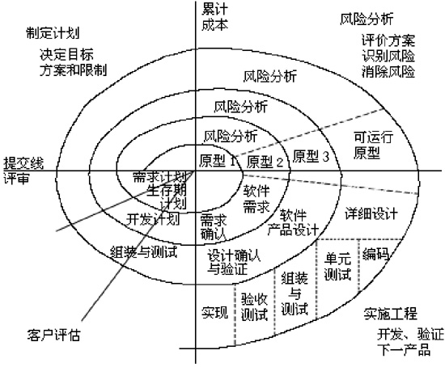

# 软件工程概述

## 软件

* 软件是计算机系统中与硬件相互依存的另一部分

* Software = Program + Data + Document

## 软件危机

### 表现

* 对软件开发成本和进度估算很不准确

* 难以准确获取用户需求，用户不满意
    
* 质量不可靠，没有适当文档

* 缺乏方法指导和工具支持，大型软件系统经常失败

* 供不应求
    
### 原因

* 客观：软件本身特点
    * 逻辑部件
    * 规模庞大

* 主观：不正确的开发方法
    * 忽视需求分析
    * 软件 != 程序
    * 轻视软件维护

## 软件工程

* 定义：

    开发、运行和维护软件的系统方法。

## 软件工程方法学

软件生命周期全过程中使用的一整套技术方法的集合成为方法学

* 三要素：

    * 方法：完成软件开发的技术方法，回答“怎样做”
    
    * 工具：自动或半自动的软件工程支撑环境
    
    * 过程：完成各项任务的工作步骤，将软件工程的方法和工具综合起来达到合理、及时进行软件开发的目的

* 方法学：

    * 传统方法学（结构化方法学、面向数据流方法学、生命周期方法学）：将软件生命周期分为若干阶段，每个阶段相对独立

    * 面向对象方法学：以数据为主线，把数据和对数据的操作结合起来

* 与计算机科学的区别：

    计算机科学侧重于理论研究，软件工程强调如何有效建造一个软件系统。

## 软件生命周期

* 计划时期：
    * 问题定义
    * 可行性研究
    * 需求分析
    
* 开发时期：
    * 总体设计
    * 详细设计
    * 编码
    * 测试

* 运行时期：
    * 软件维护

## 软件过程模型

### 瀑布模型

#### 特点

* 阶段间具有顺序性和依赖性
* 推迟实现（反对直接上手写代码）
* 质量保证
    * 强调文档
    * 强调评审
    * 文档驱动：螺旋模型——风险驱动

#### 缺陷

* 完全、精确的刻画用户需求不可能

* 需求分析和软件实现不可分割

* 用户需要有足够耐心，等到系统开发完成

### 快速原型模型

#### 特点

* 快速开发工具

* 循环

* 低成本

#### 缺点

* 开发不便于管理

* 为了演示，可能采用不适合的操作系统、编程语言、效率低下的算法，这些不理想的选择可能成为系统的组成部分

### 增量模型

把软件产品作为一系列的增量构件（小而可用的软件，根据功能区分）来设计、编码、集成和测试。每个构件由多个互相作用的模块构成，并且能够完成特定的功能。

#### 特点

* 在前面增量的基础上开发后面的增量

* 迭代的思路

#### 缺点

* 构件集成复杂且有风险

### 螺旋模型

螺旋模型的基本思想是，使用原型及其他方法尽量降低风险。可以看做在每个阶段前都增加了风险分析过程的快速原型模型。

#### 特点

* 瀑布模型 + 快速原型 + 风险分析
* 迭代过程
* 风险驱动

