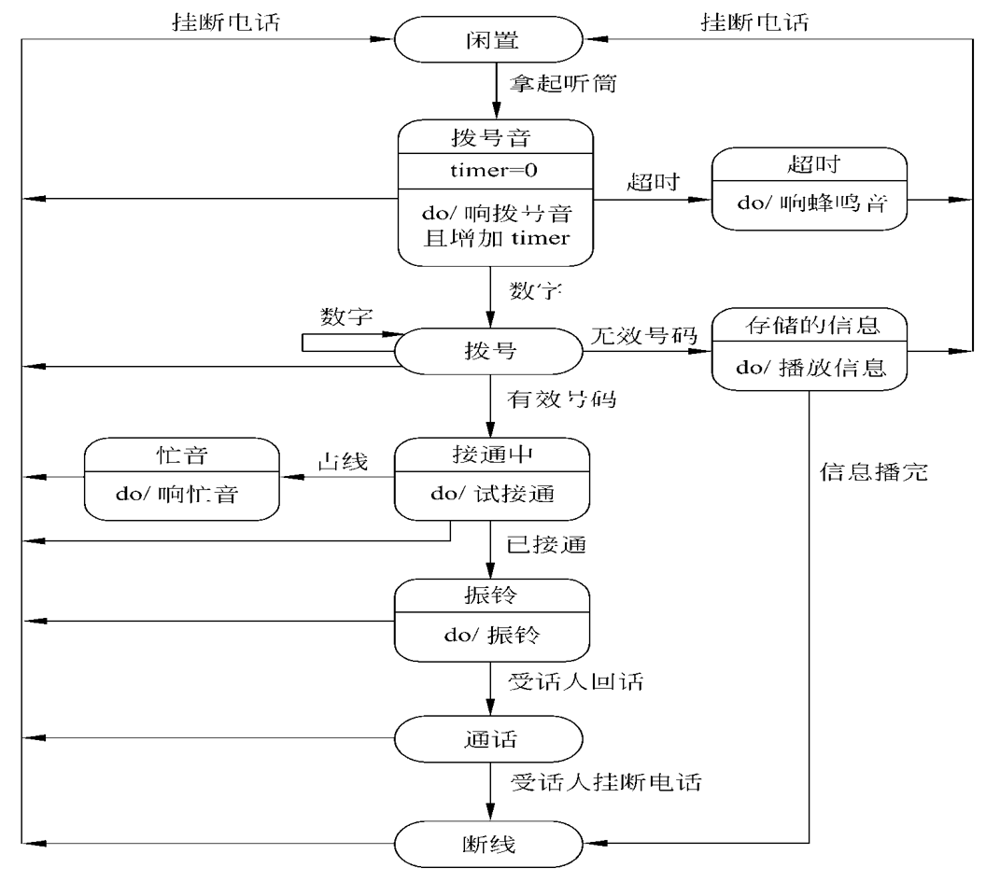

# 需求分析

## 需求分析的任务

基本任务是准确回答”系统必须做什么“，即对目标提出完整、准确、清晰、具体的要求。

在需求分析阶段结束之前，应写出**软件需求规格说明书(Software Requirement Specification)**。

## 分析建模

### 实体-联系图 ERD

Entity Relationship Diagram，描绘数据对象及数据对象之间的关系，是按照用户的观点对数据建立的模型，反映了用户的现实环境。

### 数据流图 DFD

描绘数据在软件系统中移动时被变换的逻辑过程。

### 状态转换图 STD

描绘系统各种状态和不同状态间转换的方式。

## 数据规范化

软件系统经常使用各种长期保存的信息，保存在数据库或文件中，为 **减少数据冗余**，**避免出现插入异常或删除异常**，简化修改数据过程，通常需要把数据规范化。

通常使用 **范式** 定义消除数据冗余的程度。第一范式（1NF）数据冗余程度最大，第五范式（5NF）数据冗余程度最小。

范式并非越高越好：

* 范式越高，需要分解成更多张表

* 范式越高，数据稳定性越差

* 范式越高，访问表增多，性能下降

**大多数场合选用 第三范式 比较恰当**
