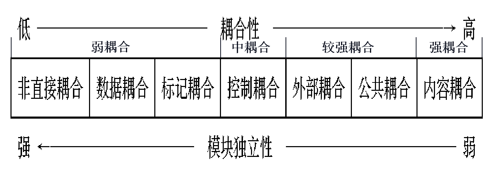

# 概要设计

## 软件设计

* 概要设计：将软件需求转化为数据结构和软件的系统结构，即系统模块划分。

* 详细设计：对系统每个模块进行细化，得到软件详细数据结构和算法。

## 软件设计原理

### 模块化

* 模块：执行一个特殊任务的一组例程和数据结构

* 模块化：把系统分解为若干模块的过程

* 原则：**高内聚，低耦合**

#### 耦合

* 内容耦合：一个模块直接修改或操作另一个模块的数据

* 公共耦合：两个以上的模块共同引用一个全局数据项

* 控制耦合：一个模块向另一个模块传递一个控制信号

* 标记耦合：两个模块至少有一个通过界面传递的公共参数

* 数据耦合：模块通过参数传递基本类型的数据

#### 内聚

模块之内个成分之间相互依赖程度的度量

* 偶然内聚：一个模块之内各成分没有任何关系

* 逻辑内聚：几个逻辑相关功能放在同一模块

* 时间内聚：一个模块完成功能必须在同一时间内完成，这些功能只因为时间因素关联在一起

* 过程内聚：处理成分必须以特定次序执行

* 通信内聚：各成分都操作同一数据集

* 顺序内聚：各成分与一个功能相关，且一个成分输出作为另一成分输入

* 功能内聚：模块内所有成分对完成单一功能是最基本的，且该模块对完成这一功能而言是充分必要的

### 抽象

### 逐步求精

### 信息隐藏和局部化

## 设计阶段

### 接口设计

* 模块间接口设计

* 软件与其他软硬件系统间接口设计

* 软件与用户间交互设计（人机界面设计）

### 数据设计

根据数据字典来确定软件涉及的文件系统结构及数据库的表结构。